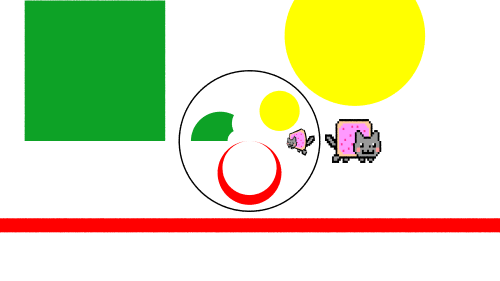

# Introduction
クライン群を扱った書籍に"インドラの真珠"がある．この本は，数学者以外にクライン群の魅力を伝えるために書かれている．中には研究者レベルの高度な内容も出てくるが，高校卒業レベルの数学と簡単なプログラムを組む能力があれば，読み進めることができる．

数学的に厳密な話はインドラの真珠や双曲幾何学への招待といった双曲幾何学の入門書籍を当たってもらうことにして，ここではざっくりとした説明に留めておく．
## What is the word "Group"?
ここで話題にする"群"(Group)という語は変換の集まりと思うことにする．
中でも，クライン群はメビウス変換を群の構成要素にもつ群の中で離散性を持つものである．
ここで扱う変換にはラベルがつけられる．
## Mobius Transformations
メビウス変換は一次分数変換とも呼ばれ，以下のように表現される
$$f(z) = \frac{az + b}{cz + d}$$
2x2複素数行列として表現できる．メビウス変換は等角性や円円対応といった性質を持つ．
## Inversion
ここで，重要な変換である円の反転をみておく．
円に関する反転は円の中心を無限遠店に，無限遠点を円の中心に持ってくる操作である．
式は以下のようになる．  
 \frac{(P - C) * R^2}{distance(P, C)^2}   
  
上の画像では黒い円による反転でいくつかの図形を映した像を描いている．直線は円に，円は円に移る．変換の前後で角度は変わらない（つまり，緑色の四角形の内角は変換後も直角を保つ）が面積は大きく変化する．また，半径無限の円は直線と考えることができ，その反転は直線に関する反転となる．
同様にして球による反転も定義することができる．

# Visualization
群の可視化手法には大きく分けて２つある．一つは変換の軌道を見る方法と極限集合を見る方法である．
# The orbit
特定の図形を群の元で移していき，その軌道を見る．
４つの円の反転を生成元に持つ群の可視化を考える．それぞれの円の反転は自分以外の円を自分の内側に移す．よって，それぞれの円の内側には３つの円が移され，１２個の小円ができる．次に４つの円の反転を新たに表れた小円にも適用する．このことを繰り返すと，以下の画像のように，円が入れ子状につらなる図を得ることができる．これが群の生成元による軌道である．また，円列の極限を極限集合とよぶ．
以下はJavaScriptで４つの円の反転で構成される群の軌道を表す円列を計算するコードである．
```javascript 
let orbits = [];
orbits.push(schottkyCircles); // level 0
for(let level = 1 ; level < MAX_LEVEL ; level++){
    orbits.push([]);
    for(let i = 0 ; i < orbits[level - 1].length ; i++){
        let orbitCircle = orbits[level-1][i];
        for(let j = 0 ; j < schottkyCircles.length ; j++){
            if(schottkyCircles[j].contains(orbitCircle)) continue;
            let nc = schottkyCircles[j].invert(orbitCircle);
            orbits[level].push(nc);
        }
    }
}
return orbits;
```
このアルゴリズムは変換で構成される木構造を幅優先探索で探索することに等しい．
インドラの真珠では以下のように，ショットキー群(Schottky Groups)における生成元であるショットキー円の軌道を描画している．ショットキー群はショットキー変換を構成要素に持つ群である．ショットキー変換は円をペアで構成され，相手の円の外側を自分の円の内側に，自分の円の外側を相手の円の内側へと変換する．この変換は二つの円盤の反転と同一視できる場合がある．

# The Limit Set
前節でみた極限集合を直接描くアプローチもある．円の軌道を描く方法は，生成元が限定的になってしまう．メビウス変換は２ｘ２の複素数行列で表現できるため，８つのパラメータがある．ただし，このままでは自由度が高すぎるため，適切に制限を加えた群の”レシピ”が存在する．
生成元や，探索を深くするごとに指数オーダーで計算量が増えてしまう．木構造の探索は並列化が難しいため，
最近のOpenCLやCUDAといった並列計算プラットフォームではDynamic Parallelismという機能をサポートしている．この機能を用いることで，極限集合，軌道の並列計算を行うことができる．

非離散的と呼び，変換が収束しなくなる．
クライン群ではなくなる．しばしば興味深い現象，図像に出くわす．

# Iterated Inversion System
円や球の反転で構成される群を高速に描画するためのアルゴリズム，Iterated
Inversion System (IIS)について記述する．
## Basic Algorithm
先ほど紹介した軌道の探索と逆をピクセルごとに行う．
平面上の各点に対し，その点がいずれかの円の内部にある時に円に関する反転を行う．移動した点が基本領域に落ちるまで反転を繰り返す．最終的な反転回数がその点が属する円の深さを表す．よって，反転回数に応じて色を決めることで，すべての円の軌道が描画される．以下に疑似コードを示す．
```cpp
const int ITERATIONS = 30;
int IIS(vec2 pos){
    int loopNum = 0;
    bool loopEnd = true;
    for(int i = 0 ; i < ITERATIONS ; i++){
        loopEnd = true;
        for(Circle c : schottkyCircles)
            if(c.contains(pos)){
                pos = circleInvert(pos, c);
                loopEnd = false;
                loopNum++;
            }
        }
        if(loopEnd) break;
    }
    return loopNum;
}
```
この方法は，すべての点に関して独立に計算を行うことができるため，容易に並列化が可能である．筆者は主にOpenGL Shading Language(GLSL)を用いることでこれらの図像をリアルタイムにレンダリングしている．
## 3D Extension
このアルゴリズムは球の反転を用いることで，三次元形状を得ることもできる．
ただし，二次元と同様のショットキー球の軌道ではなく，ベースとなる球をショットキー球による反転で移した軌道を描くことにする．
ショットキー球の軌道を描くと，球が入れ子状になってしまう．入れ子の球の描画には計算コストがかかるため，ここでは用いない．
画像では，緑色の球が周囲の灰色の球による反転で移された像を見ることができる．
レイマーチングというレイトレーシングの手法を用いる．レイマーチングはレイと物体との交点を近似的に求める手法である．レイマーチングに関しては，Appendixを参照のこと．
軌道の距離関数を導出するため，まずは画像の断面を考える．
赤の円がベース球の軌道，青の円がショットキー球の軌道の断面，黄色の点がレイの先端である．この場合，S2が最も近い球であるが，ベース球であるS1以外の座標と半径はわからない．S2はショットキー球S3による反転でS1に移るため，ヤコビアンを用いて距離を近似する．
球の反転のヤコビアンは以下のように計算することができる．
点が基本領域に落ちた後，ベース球との距離を求め，その距離をこれまで行ったすべての反転のヤコビアンの積で割る．これにより，球S2とレイの先端との距離を求めることができる．
もう一つ考慮すべき点がある．レイが極限集合より外側に存在するとき，そのままでは，レイが意図せずして他の物体を通り抜けてしまう．その結果として図のようなアーティファクトが発生する．これを防ぐために，距離をスケールする係数をかけ合わせる．

以下に疑似コードを示す．

ベースとなる球の大きさによって興味深い変形を見ることができる．例えば，極限集合に被せるくらいの半径とすると，球の上に極限集合が乗った像を得ることができる．

# Geometrical Representation of Mobius Transformations
多くの場合，行列表現で与えられる．高次元のクライン群（インドラの真珠であつかうクライン群はすべて二次元の図に帰着させることができる）になると，四元数行列となり，パラメータ数はさらに増大する．そこで筆者らはすべてのメビウス変換を円や球の反転で構成することを考えた．そうすることで幾何学的な直観を得ることができる．また，IISを用いることで複雑な生成元をもつ群もリアルタイムに可視化することができる．このことは，研究者や学習者だけでなく，フラクタルアーティストにも有益なものとなるだろう．


